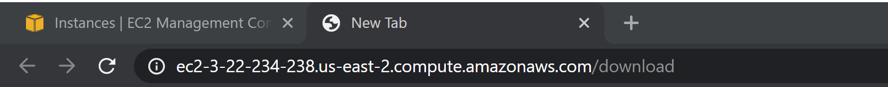
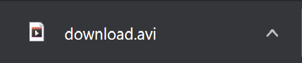

# Twitter Summarizer Rest Service

## Assignment Requirements

* I used Flask as my WEB service platform
  * Reference 1:  [https://palletsprojects.com/p/flask/] (Github:  [https://github.com/pallets/flask])
  * Reference 2:  Flask-RESTFUL  (Github:  [https://github.com/flask-restful/flask-restful] )
* Step 2:  I integrated my module from the prior Homework to become a RESTFUL system
* Deploy your system to free AWS services:  [https://aws.amazon.com/free/?all-free-tier.sort-by=item.additionalFields.SortRank&all-free-tier.sort-order=asc]
* I developed a simple WEB application to test my system.
* Documentation for my REST APIs on my Github

## Using this API and Documentation for it

What the API I implemented does is allow the user to see summaries of 20 tweets on their timeline. This simple api will implement a single get request response that will return a video to the web browser that the use is currently on as an attachment. The user passes in the url and that indicates that they want to get the video of the summaries.

If you want to change the usernames for the twitter feed you want to receive you can change the value of your keys in the videoFFmpeg.py file.

The documentation for retreiving the summary is as follows:

[EC2 ADDRESS]/download

An image of the url is shown below

When you submit that link it will generate based on the keys in the videoFFmpeg.py file a summary of 20 of that user's tweets in a one minute video format, it will show up as an attatchment in the browser like this.

The EC2 Address will be regnerated everytime I shutdown and run the instance, so please inform me when you want to test this API.
